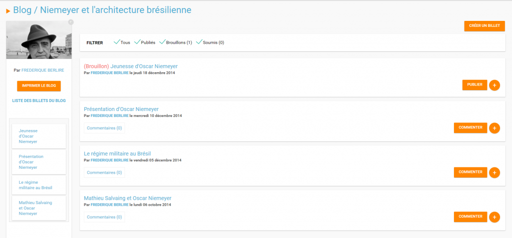
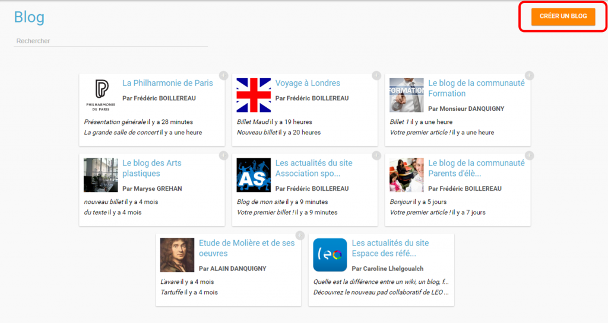
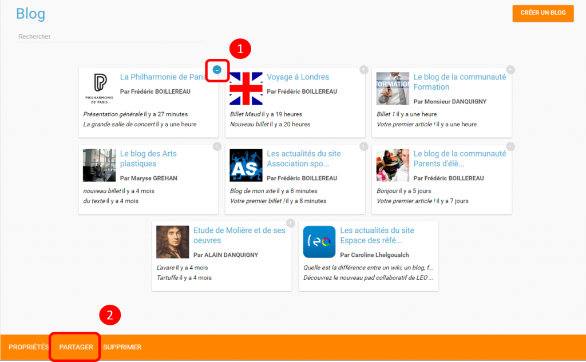
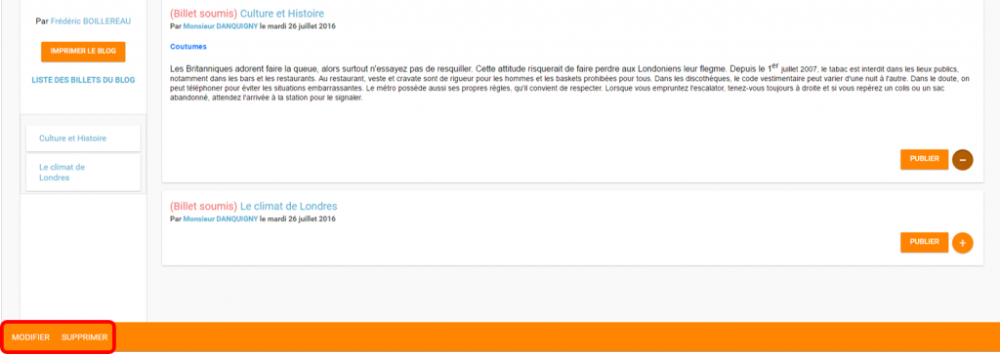

Endossez la casquette du petit reporter en créant un **Blog** ! Publiez et partagez facilement vos informations, en y intégrant différents types de contenus : texte, images, vidéos, etc. Permettez à vos collègues ou vos élèves de contribuer ou de commenter vos billets facilement.

Présentation
============

L’appli **Blog** permet de publier facilement des informations, en y intégrant **différents types de contenus** : texte, images, fichiers audio, vidéos, liens externes, etc. Les articles ou « billets » de blog sont datés, identifiés par leur auteur et sont affichés par ordre chronologique inversé (visualisation des derniers contenus publiés en haut de page).

En cas de contribution de la part d’autres utilisateurs, le gestionnaire du blog choisit le **circuit de publication** souhaité : soit il relit les billets soumis par les autres utilisateurs avant de les publier, soit les billets sont publiés immédiatement quel qu’en soit l’auteur.

Créer un blog
=============

Cliquez sur la page « Mes applis » puis sur l’icône « Blog ».

Dans le service Blog, cliquez sur le bouton « Créer un blog » présent en haut à droite de la page.

Vous accédez à l’interface de création du blog.

1.  Indiquez le titre de votre blog.

2.  Ajoutez une vignette d’illustration du blog (si vous ne modifiez pas l’image, c’est la vignette par défaut qui s’affichera).

3.  Cliquez sur « Enregistrer ».

 

Partager un blog
================

Pour partager un blog avec d’autres utilisateurs, suivez les étapes suivantes :

1.  Cliquez sur le + du blog (1)

2.  Cliquez sur le bouton « Partager » (2)

Le blog a été créé mais n’est pas encore visible par les autres utilisateurs. Pour le partager, suivez les étapes suivantes :

1.  Saisissez les premières lettres du nom de l’utilisateur ou du groupe d’utilisateurs que vous recherchez.

2.  Sélectionnez le résultat.

3.  Cochez les cases correspondant aux droits que vous souhaitez leur attribuer.

Pour valider, cliquez sur le bouton "Partager".

Les différents droits que vous pouvez attribuer aux autres utilisateurs sont les suivants :

-   **Consulter** : l’utilisateur peut lire le contenu du blog

-   **Contribuer** : l’utilisateur peut publier un nouveau billet

-   **Gérer** : l’utilisateur peut gérer le blog, c’est-à-dire le modifier, le partager ou le supprimer

-   **Commenter** : l’utilisateur peut commenter les billets

Gérer le circuit de publication
===============================

Pour gérer le circuit de publication de votre blog, ouvrez la fenêtre de partage. Vous pouvez choisir entre deux options :

-   **Publication immédiate** : lorsque des utilisateurs contributeurs créent un billet, celui-ci est directement publié dans le blog.

-   **Billet à soumettre** : lorsque des utilisateurs contributeurs créent un billet, le billet passe au statut « Soumis » et c’est le gestionnaire du blog qui effectue l’action de publication du billet.

image:/assets/Partage blog Circuit de publication.png\[width=550,height=368\]

Publier un billet
=================

Une fois votre blog créé, vous pouvez publier un billet. Pour cela, cliquez sur le bouton « Créer un billet » présent en haut de l’écran.

L’outil de création du billet s’affiche dans la page :

1.  Saisissez le titre

2.  Rédigez le contenu du billet.

Une fois la saisie terminée, vous pouvez soit :

-   **Enregistrer le billet** : il passe alors au format brouillon et n’est pas visible des autres utilisateurs ayant accès au blog

-   **Publier le billet** : le billet est alors visible par les utilisateurs ayant accès au blog

-   **Annuler** la création du billet

Pour les utilisateurs pouvant contribuer à un blog dans lequel le circuit de publication a été activé, un bouton « Envoyer » s’affiche : il leur permet de soumettre leur billet au gestionnaire du blog qui se chargera de la publication ou non du billet.  

Valider un billet
=================

Si vous avez activé un circuit de publication (billets à soumettre pour les contributeurs), les billets en attente de validation se trouvent dans la catégorie « Soumis ».

Cliquez la case à cocher des billets soumis pour afficher les billets rédigés par les contributeurs du blog.

Vous pouvez réaliser les actions suivantes en cliquant sur « Publier » ou sur l’icône  :

-   **Publier** le billet sans mise à jour : le billet est alors visible par tous les utilisateurs ayant accès au blog

-   **Modifier** le billet avant publication : vous accédez à l’éditeur de texte pour apporter vos modifications

-   **Supprimer** le billet

