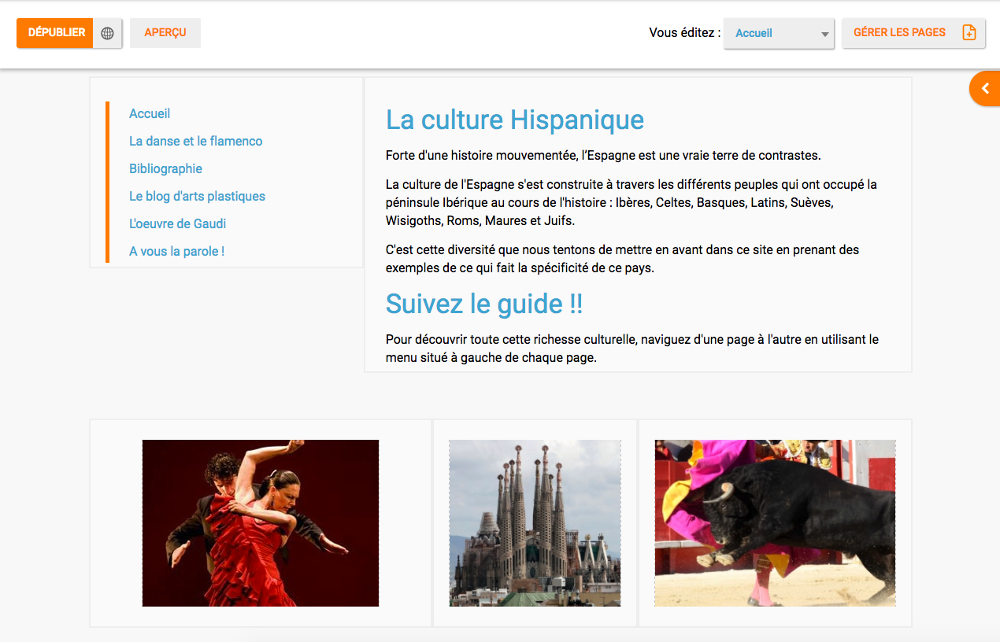
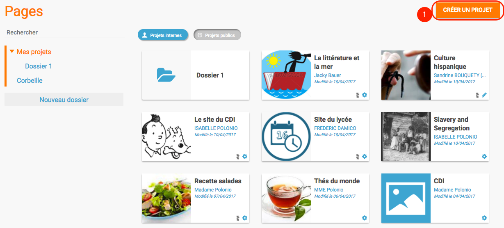
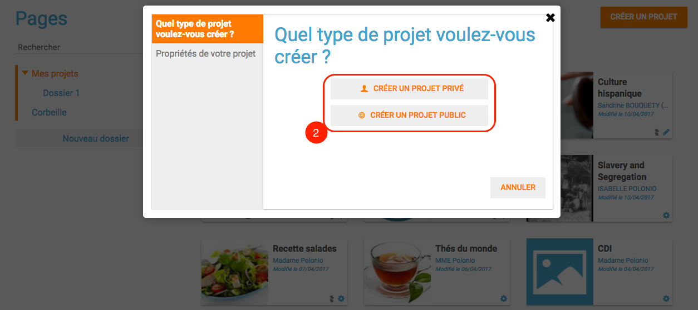
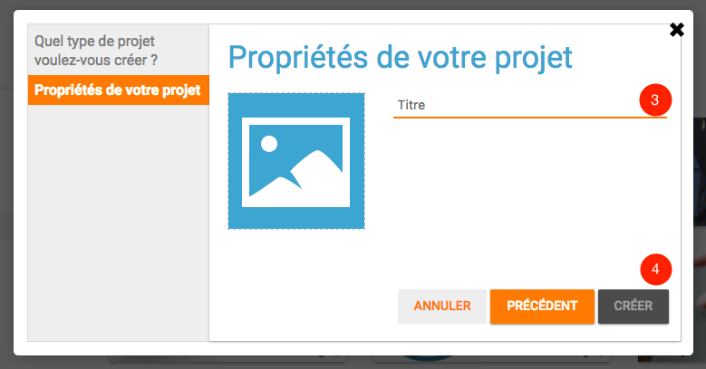
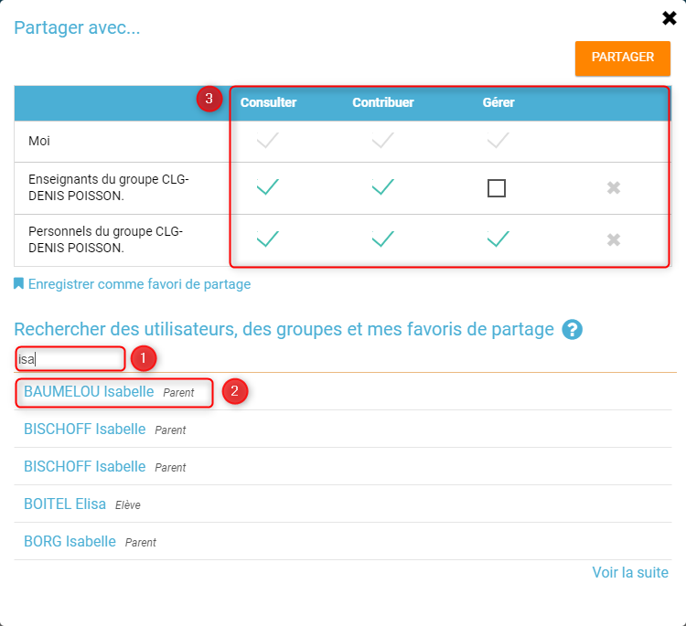
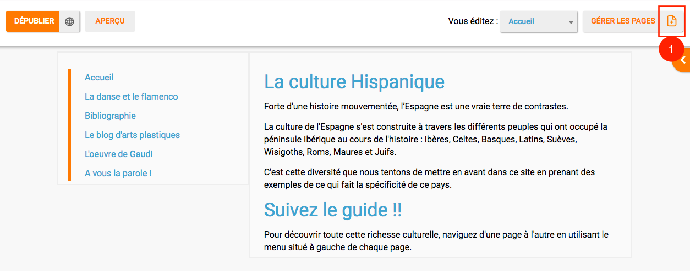
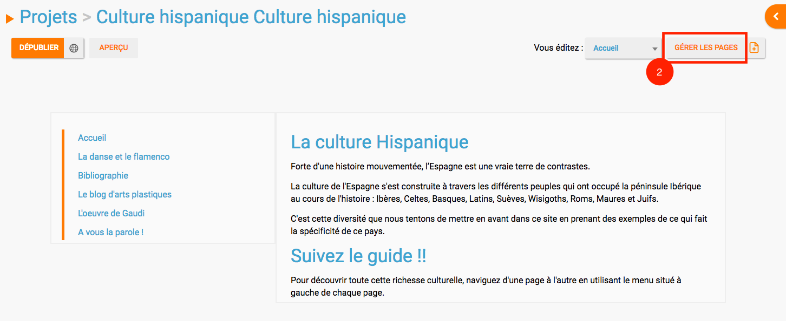

# Pages

Créer vos propres sites web en quelques clics ! Avec l’appli **Pages**, vous pouvez créer et publier des contenus facilement sur votre propre site, composé, par exemple, des productions provenant d’autres applications comme vos Blogs ou vos Frises Chronologiques. Pratique !

## Présentation

L’appli Pages permet de créer des pages web qui sont organisées entre elles grâce à un menu de navigation, et offrant une grande liberté de mise en page du contenu.

Il est possible d’insérer dans ces pages **différents** types de contenus **\*\*\(texte, image, son, vidéo…\) et** des liens vers d’autres contenus\*\*. En particulier, si un lien est enregistré vers un blog, une frise chronologique, un wiki, ou un forum existant, la page sera automatiquement mise à jour avec les nouvelles publications effectuées dans le blog, la frise, le wiki ou le forum.

## Créer un projet

Depuis la page d’accueil, cliquez sur « Mes applis » en haut à droite de l’écran puis cliquez sur « Pages ».

* Pour créer un projet : Cliquez sur « Créer un un projet» \(1\)
* Choisissez ensuite si vous voulez créer un projet privé ou public \(2\)

Lorsque vous créez un site public celui-ci est visible de tous dans l’ENT. De plus, toute personne extérieure à l’ENT peut accéder à ce site si elle dispose du lien.

Dans la fenêtre, saisissez le titre de votre site \(3\) puis cliquez sur le bouton « Créer » \(4\)

Votre site web est maintenant créé, vous pouvez le compléter en y intégrant des contenus.

## Partager un projet

Pour partager votre page, avec d’autres utilisateurs, suivez les étapes suivantes :

1. Sélectionnez la case à cochez de la page \(1\)
2. Cliquez sur le bouton "Partager" \(2\)

La fenêtre de partage apparaît. Pour attribuer des droits à d’autres utilisateurs, suivez les étapes suivantes :

1. Saisissez les premières lettres du nom de l’utilisateur ou du groupe d’utilisateurs que vous recherchez \(1\).
2. Sélectionnez le nom de l’utilisateur ou du groupe \(2\).
3. Cochez les cases correspondant aux droits que vous souhaitez leur attribuer \(3\).

Cliquez ensuite sur le bouton "Partager"

Vous pouvez attribuer différents droits aux autres utilisateurs :

* Consulter : l’utilisateur peut consulter la page
* Contribuer : l’utilisateur peut créer des pages qui vous seront soumises avant publication
* Gérer : l’utilisateur peut modifier, partager ou supprimer la page

## Créer et éditer une nouvelle page

Pour créer une nouvelle page, vous pouvez :

* Cliquer sur l’icône d’ajout d’une page sur lorsque vous éditez votre projet \(1\)

* Ou cliquer sur gérer les pages \(2\), puis sur "nouvelle page" \(3\)

