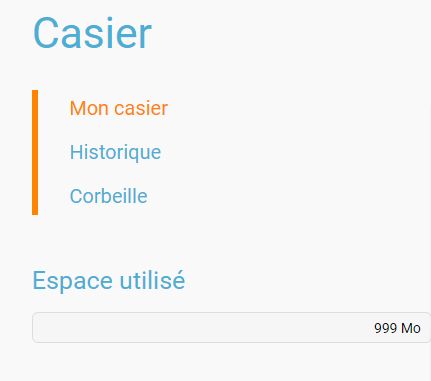

# Casier

Un devoir à rendre ? Rien de plus simple, grâce à l’appli **Casier**, déposez vos documents dans le casier d’autres utilisateurs. Les documents ainsi échangés sont horodatés pour une plus grande sécurité !

## Présentation

Pour accéder à l’appli Casier, cliquez sur l’icône correspondante dans la page « Mes applis ».

Le casier est composé de 3 dossiers :

Le dossier « **Mon casier** » contient les documents envoyés dans mon casier.  
Le dossier « **Historique** » contient les documents déposés par l’utilisateur dans le casier d’autres utilisateurs. Pour chaque document reçu, le titre du document, l’identifiant du destinataire ainsi que la date et l’heure d’envoi sont précisés.  
Les documents supprimés sont disponibles dans le dossier « **Corbeille** » avant suppression définitive.


Lorsqu’un document a été déposé dans un casier, il n’est **pas possible de le modifier, ni de le supprimer a posteriori**. Il est néanmoins possible de faire un second envoi avec une nouvelle version du document.


## Déposer un document dans un casier

Pour déposer un document dans le casier d’un autre utilisateur, accédez à l’appli Casier puis cliquez sur le bouton « Déposer dans un casier ».

Dans la fenêtre, cliquez sur « Parcourir » \(1\) pour sélectionner sur votre ordinateur le document à envoyer \(ou faites un glisser-déposer\) puis sélectionnez le\(s\) destinataire\(s\) \(2\). Vous pouvez retrouver vos favoris dans la barre de recherche. Une fois les utilisateurs sélectionnés, ils apparaissent à droite dans "Tous les utilisateurs ajoutés". Vous pouvez consulter leur fiche utilisateur en cliquant sur le nom, ou bien les supprimer de votre sélection en cliquant sur la croix à droite de leur nom. Vous pouvez choisir un utilisateur ou un groupe d'utilisateurs.

Cliquez ensuite sur « Envoyer » \(3\) pour envoyer le document. Un message de confirmation vous informe que le document a bien été envoyé.

## Sélection et action sur les documents

Pour sélectionner un fichier, vous devez cliquer une fois dessus. Le fichier est alors surligné en bleu \(1\) et le menu d’option s’affiche en bas de page \(2\). Vous pouvez également sélectionner plusieurs documents en même temps pour effectuer une action sur tous ces documents.

Vous disposez également d’un bouton "télécharger" sur chaque fichier si vous souhaitez télécharger directement le fichier sur votre ordinateur.

## Copier un document du casier vers l’appli Espace documentaire

Lorsque vous recevez un document dans votre casier, vous avez la possibilité de le copier vers un dossier de votre espace documentaire. Connectez-vous à l’appli Casier et consultez le dossier « Mon casier ». Sélectionnez le document et cliquez sur le bouton « Copier dans mes documents » en bas de page.

La nouvelle fenêtre vous présente l’arborescence du dossier « Mes documents » \(1\), vous pouvez créer un nouveau dossier directement depuis cette fenêtre \(2\), et copier le document dans le dossier que vous avez sélectionné \(3\).

