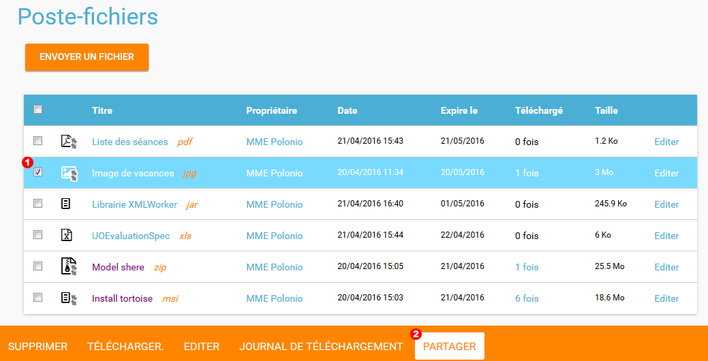
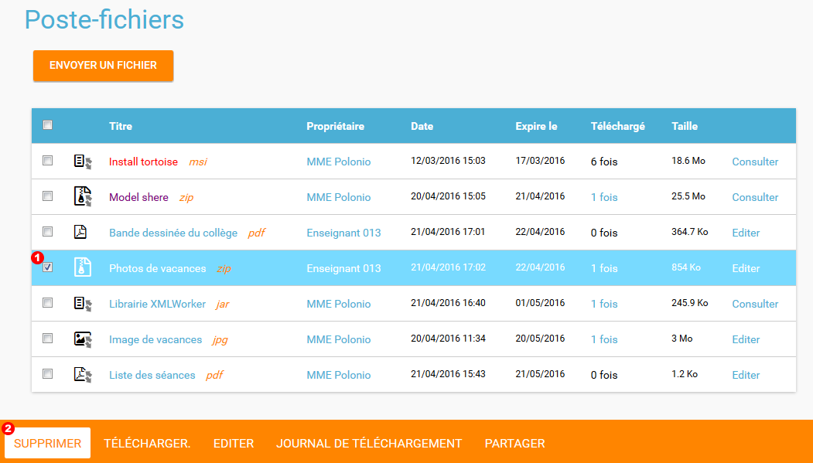
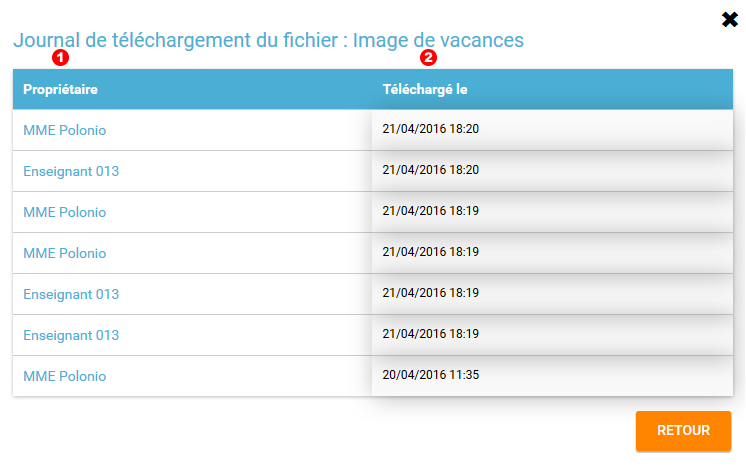

# Poste-fichiers

Vos documents, comme sur un nuage ! Comme son nom l’indique, l’appli **Poste-fichiers** permet de stocker en ligne ses documents volumineux et de les consulter n’importe où, pendant 30 jours.

## Présentation

Poste-fichiers est un service de partage de fichiers volumineux. Il vous permet de partager des fichiers avec d’autres utilisateurs pour une durée allant jusqu’à 30 jours.

Chaque utilisateur dispose d'**un** **espace de stockage dédié uniquement à cette application**. Les fichiers déposés dans cette application n’impacteront pas le quota utilisé par l’application document de l’utilisateur.

Les fichiers peuvent être téléchargés par les utilisateurs avec qui il ont été partagés pendant toute la durée de vie du fichier. Pour chaque fichier partagé, les gestionnaires et contributeurs peuvent consulter le journal de téléchargement du fichier.

Suite à la péremption du fichier, le fichier est supprimé et ne peut plus être téléchargé. Un fichier supprimé reste affiché dans la liste, sans pouvoir le télécharger. Les utilisateurs peuvent consulter le détail du fichier et, s’ils en ont les droits, peuvent également consulter l’historique de téléchargement.

## Liste des fichiers

La page d’accueil de Poste-fichiers affiche les fichiers que vous avez déposés et ceux qui ont été partagés avec vous par d’autres utilisateurs.

Le bouton "Envoyer un fichier" vous permet de déposer un nouveau fichier.

Voici le détail des informations et actions présentes dans la liste des fichiers :

* **Case à cocher**: vous permet de sélectionner un ou plusieurs fichiers
* **Icône** : vous indique le type de fichier. Le symbole de double-flèche, en superposition de l’icône du type de fichier, signale que le fichier a été partagé avec d’autres utilisateurs.
* **Titre** : le titre du fichier qui a été saisi pour le fichier. Si le fichier est encore disponible, vous pouvez le télécharger en cliquant sur son **titre**. Les fichiers dont la date de péremption est dépassée sont affichés en **rouge** et une info-bulle indique que le fichier n’est plus disponible. Si la date de péremption est arrivée à terme le jour même, le titre du fichier est affiché en **violet** et une info-bulle indique que le fichier ne pourra plus être téléchargé passé 24h.
* **Extension**: type d’extension du fichier.
* **Propriétaire**: nom de l’utilisateur qui a déposé le fichier.
* **Date**: date et heure du dépôt du fichier.
* **Expire le**: date au-delà de laquelle le fichier ne pourra plus être téléchargé. Passé ce délai, le fichier reste affiché dans la liste mais il ne sera plus possible de le télécharger ni par l’auteur, ni par les utilisateurs avec qui il est partagé.
* **Téléchargé**: nombre de téléchargements du fichier. Si vous disposez des droits de contributeur ou plus, en cliquant sur le nombre de téléchargements, vous pouvez consulter le journal de téléchargements du fichier.
* **Taille**: taille du fichier.
* **Editer/Consulter**: permet de modifier/consulter le détail du fichier qui a été saisi par le propriétaire lors du dépôt du fichier.

En cochant une ou plusieurs cases de sélection de fichier, une barre d’actions est affichée en bas de la page. Les actions affichées dépendent du nombre de fichiers sélectionnés et des droits dont vous disposez sur ces fichiers. Les actions disponibles sont :

* Supprimer
* Télécharger
* Éditer
* Journal de téléchargement
* Partager

## Envoyer un fichier dans mon espace de stockage

Pour envoyer un fichier dans votre espace de stockage, cliquez sur le bouton "Envoyer un fichier". Un message vous indique l’espace disponible \(1\) dans le volume de stockage dédié à cette application. Saisissez le nombre de jours \(2\) durant lesquels le fichier pourra être téléchargé, le nom du fichier \(3\), une description \(4\).

Cliquez sur le bouton  pour sélectionner sur votre poste de travail le fichier à déposer.

Cliquez sur le bouton "Enregistrer" pour valider le dépôt du fichier dans votre espace de stockage. Durant le dépôt du fichier, une barre \(1\) affiche le pourcentage d’avancement du téléchargement du fichier sélectionné dans votre espace de stockage.

## Partager un fichier

Pour partager un ou plusieurs fichiers avec d’autres utilisateurs, cochez les cases des fichiers à partager \(1\) puis cliquez sur le bouton "Partager" \(2\).

Dans la fenêtre, vous pouvez donner aux utilisateurs de l’ENT différents droits d’accès à votre fichier. Pour cela :

1. Saisissez les premières lettres du nom de l’utilisateur ou du groupe d’utilisateurs que vous recherchez.
2. Sélectionnez le résultat.
3. Cochez les cases correspondant aux droits que vous souhaitez leur attribuer.

L’icône suivante signale que le fichier a été partagé avec d’autres utilisateurs : 

Pour valider, cliquez sur le bouton "Partager".

Les droits de partage que vous pouvez attribuer aux utilisateurs sont les suivants :

* **Lecteur** : l’utilisateur peut télécharger le fichier dans la limite du délai d’expiration
* **Contribuer** : l’utilisateur peut consulter le journal de téléchargement du fichier
* **Gestionnaire** : l’utilisateur peut modifier, supprimer ou partager le fichier

## Mettre à jour un fichier

Pour modifier le titre, la description ou la date d’expiration d’un fichier, vous devez cliquer sur le lien **Editer** \(1\) de la ligne d’un fichier.

Vous pouvez également sélectionner le fichier à modifier en cochant la case \(2\) située devant le titre, puis en cliquant sur le bouton "Editer" \(3\).

Vous pouvez modifier la durée de validité \(1\) du fichier dans la limite de 30 jours à partir de la date de dépôt du fichier dans votre espace de stockage.

Modifiez le titre \(2\) ou la description \(3\) puis cliquez sur le bouton "Enregistrer" \(4\) pour valider vos modifications.

## Supprimer un fichier

Pour supprimer un fichier, vous devez sélectionner le fichier en cochant la case \(1\) située devant le titre, puis cliquez sur le bouton "Supprimer" \(2\).

## Télécharger un fichier qui a été partagé avec moi

Pour télécharger un fichier partagé avec moi, il suffit de cliquer sur le nom du fichier \(1\). Vous pouvez également sélectionner le fichier à télécharger en cochant la case \(2\) située devant le titre, puis en cliquant sur le bouton "Télécharger" \(3\).

Vous pouvez trier la liste des fichiers en cliquant sur le nom d’une colonne \(4\).

Les fichiers dont la date de péremption est atteinte peuvent toujours être téléchargés le jour-même, mais ne seront plus disponibles dès le lendemain. Dans ce cas, le titre du fichier est affiché en **violet** et une info-bulle signale « Le téléchargement est arrivé à échéance, le fichier sera supprimé dans les prochaines 24h».

Si la date de péremption a été dépassée le titre du fichier est affiché en **rouge**. Le fichier reste affiché dans la liste mais ne peut plus être téléchargé. Une infobulle indique « Téléchargement terminé, le fichier volumineux n’est plus disponible ».

## Consulter le journal de téléchargement d’un fichier

Pour consulter le journal de téléchargement d’un fichier, vous devez avoir les droits de contributeur. En cliquant sur le lien qui indique le nombre de téléchargements \(1\), le journal de téléchargement est affiché.

Vous pouvez également sélectionner le fichier en cochant la case située devant le nom du fichier \(2\) puis en cliquant sur le bouton "Journal de téléchargement" \(3\).

Le journal de téléchargement affiche la liste des utilisateurs \(1\) qui ont téléchargé le fichier et indique la date du téléchargement \(2\).

