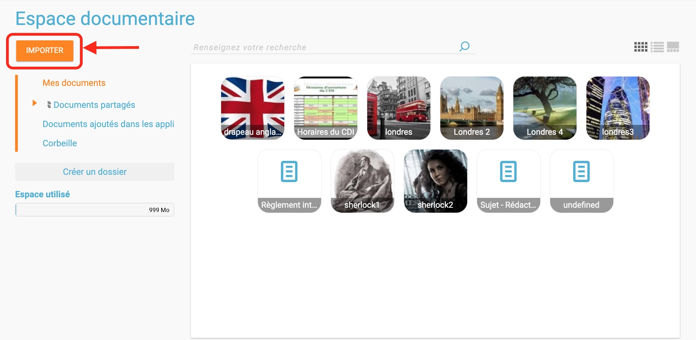
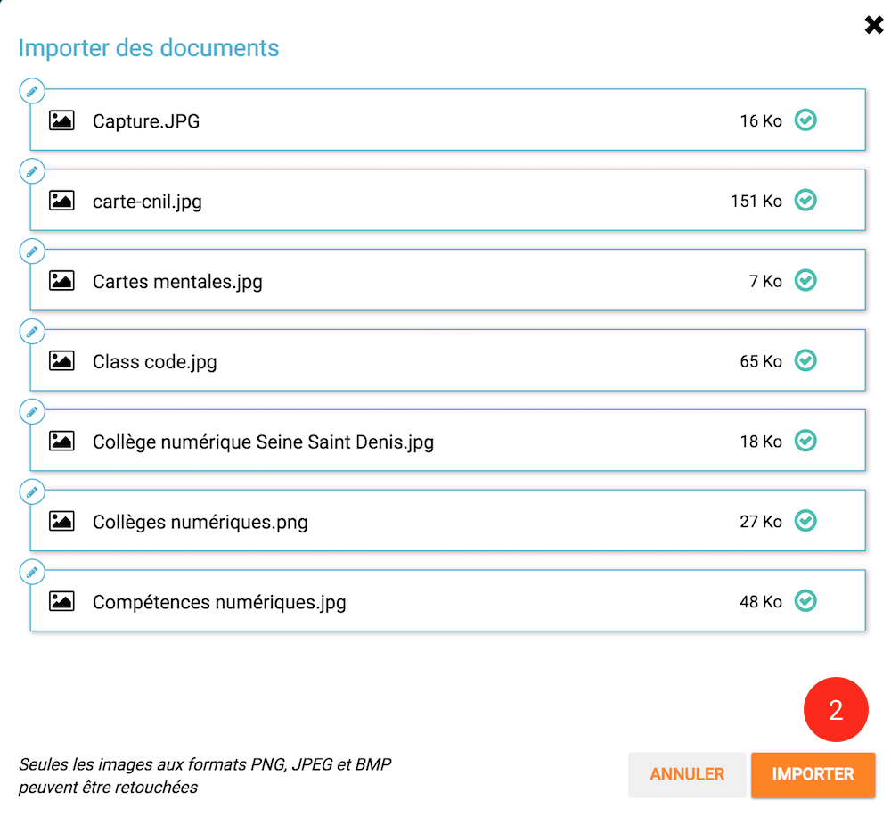
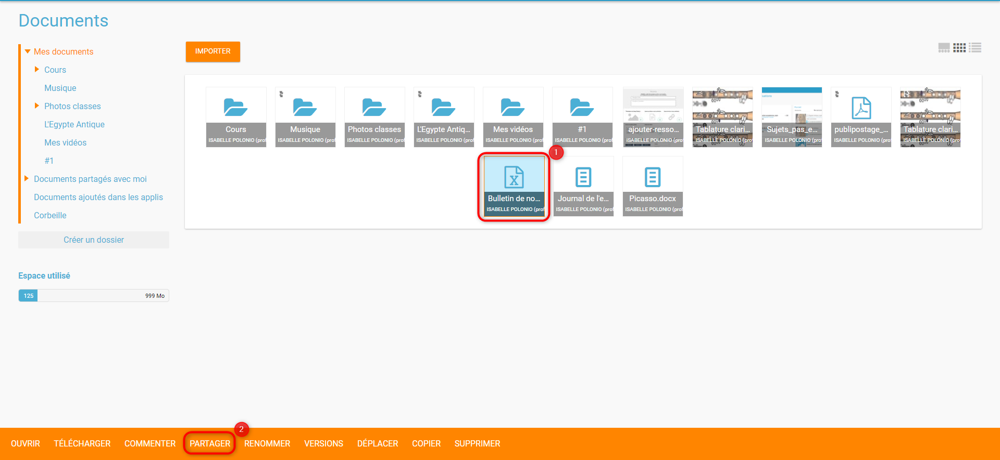
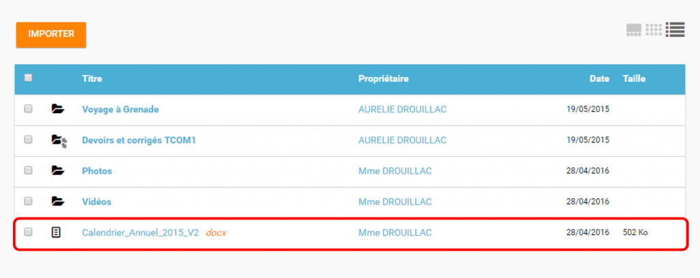
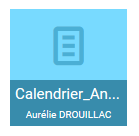

# Espace Documentaire

À chacun son classeur numérique ! Grâce à l’application **Espace documentaire**, retrouvez, au même endroit, tous les documents utilisés à travers vos applis. Stockez d’autres fichiers, organisez-les et partagez-les dans votre espace en fonction de leurs thématiques, du cours ou de la classe concernée !

## Présentation

Pour accéder à l’appli Espace Documentaire, cliquez sur l’icône correspondante dans la page « Mes applis ».

**Mes documents** : Dans ce dossier, vous pouvez charger tous types de fichiers depuis votre ordinateur, qu’il s’agisse de documents texte ou PDF, d’images, de vidéos ou d’extraits audio. Classez ces fichiers dans des dossier pour les retrouver plus facilement. En quelques clics, partagez vos documents personnels avec d’autres utilisateurs en leur attribuant des droits de consultation, de contribution, de gestion ou de commentaire, selon vos besoins.

**Documents partagés** : Vous retrouvez dans ce dossier tous les documents partagés, que d’autres utilisateurs ont partagés avec vous, ou que vous leur avez partagés.

**Documents ajoutés dans les applis** : Vous retrouverez ici tous les fichiers que vous avez ajouté dans d’autres applis \(par exemple image d’un billet de blog\).


**En centralisant l’ensemble des documents accessibles par l’utilisateur, l’appli Espace Documentaire permet d’intégrer facilement un contenu dans n’importe quelle appli.**


## Naviguer dans mon Espace Documentaire

Pour **accéder au menu d’option** d’un fichier ou d’un dossier, vous devez **cliquer une fois** dessus. Le menu s’affiche ensuite en bas de la page et vous pouvez choisir les actions à effectuer.  
Vous devez cliquer une nouvelle fois sur le fichier ou le dossier pour le désélectionner.

Pour **visualiser un fichier** sur la visionneuse de l’ENT ou pour **ouvrir un dossier**, vous devez **double-cliquer dessus**.

Vous pouvez également sélectionner plusieurs fichiers ou dossiers si vous souhaitez effectuer une action sur tous ces documents simultanément.

**ATTENTION**  
Si vous effectuez une action de partage sur plusieurs fichiers ou dossiers alors que l’un de ces fichiers ou dossiers possède déjà un partage, vous supprimerez l’ancien partage effectué sur ce fichier ou dossier.

## Importer un document

Pour importer un document dans votre espace de stockage personnel ou dans un dossier partagé avec vous \(en contribution au minimum\), cliquez sur le bouton « Importer » situé en haut de l’interface.

Dans la nouvelle fenêtre, suivez les étapes suivantes :

1. Cliquez sur « Parcourir » et sélectionnez sur votre ordinateur le\(s\) document\(s\) que vous souhaitez enregistrer dans l’espace documentaire. Vous pouvez également effectuer un glisser-déposer multiple.
2. Cliquez sur « Importer ».

**Vous pouvez importer plusieurs fichiers en une seule fois, si vous en sélectionnez plusieurs sur votre ordinateur.**

Vous pouvez aussi importer un document ou plusieurs documents en effectuant un glisser-déposer. Pour cela, sélectionnez le ou les documents à déplacer depuis votre espace de travail et glissez-le vers son nouvel emplacement !

## Partager un document ou un dossier

Pour partager votre document avec d’autres utilisateurs, suivez les étapes suivantes :

* Sélectionnez le document ou dossier en question en cliquant dessus \(1\)
* Cliquez sur le bouton "Partager" en bas de l'écran \(2\)

La fenêtre de partage apparaît. Pour attribuer des droits à d’autres utilisateurs, suivez les étapes suivantes :

* Saisissez les premières lettres du nom de l’utilisateur ou du groupe d’utilisateurs que vous recherchez \(1\) 
* Sélectionnez le nom dans la liste qui s’affiche \(2\) 
* Cochez les cases correspondant aux droits que vous souhaitez leur attribuer \(3\).

Cliquez ensuite sur le bouton "Partager"

## Déplacer un document ou un dossier

Vous pouvez déplacer vos documents et vos dossiers facilement dans votre espace documentaire. Pour cela, sélectionnez le document ou le dossier à déplacer \(1\) et glissez-le vers son nouvel emplacement \(2\).

Vous ne pouvez pas déplacer un fichier du dossier « Mes documents » vers les dossiers « Documents partagés », « Documents ajoutés dans les applis » ou même à la corbeille.

Le dossier se trouve maintenant à l’emplacement choisi.

## Connaître l’espace de stockage disponible

La jauge affichée sous la liste des dossiers de l’espace documentaire vous permet de connaître l’espace de stockage dont vous disposez. L’espace utilisé est indiqué sur la gauche. Le chiffre situé sur la droite indique l’espace total de l’utilisateur.

## Ajouter la nouvelle version d’un document

Vous pouvez mettre à jour un document tout en gardant une trace de ses précédentes versions et en conservant les droits de partage du document initial.

Pour mettre à jour un document, cliquer une fois sur le document pour qu’il soit surligner en bleu. La barre d’action s’affiche en bas de page, cliquez sur le bouton « Versions ».

Une nouvelle page s’affiche, cliquez sur le bouton « Nouvelle version ».

Choisissez le document depuis votre poste de travail et cliquez sur « Ouvrir ».

Le document a été mis à jour.

Le document sera renommé avec le libellé du dernier document importé.

**Les utilisateurs qui ont un droit de contribution sur un document peuvent mettre à jour de nouvelles versions.**

## Accéder aux anciennes versions de son document

Pour visualiser les anciennes versions d’un document, suivez les étapes suivantes:

1. Cliquez une fois sur le document pour qu’il soit surligné en bleu
2. Cliquez sur le bouton "Versions" en bas de page

Toutes les versions du document s’affichent. Chaque version permet d’accéder aux informations suivantes :

* Titre du document
* Identifiant de la personne qui a ajouté le document
* Taille du document

Il est possible de supprimer toutes les versions du document sauf la dernière mise à jour.

