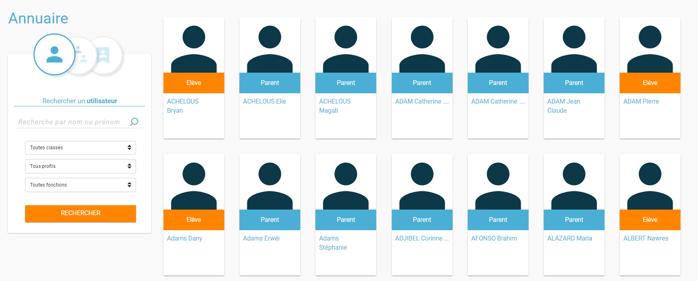
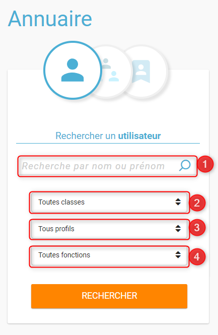
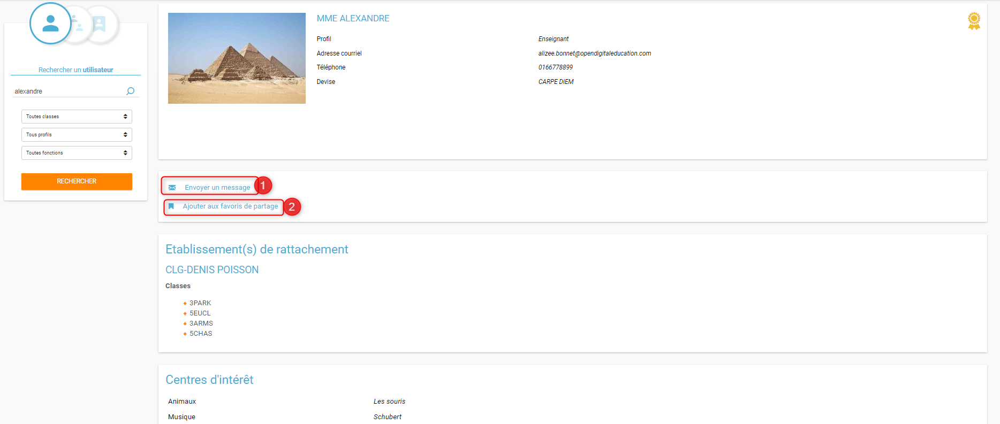
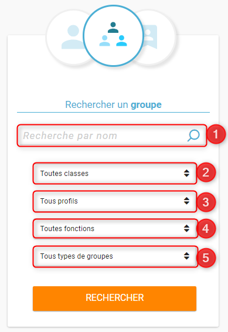
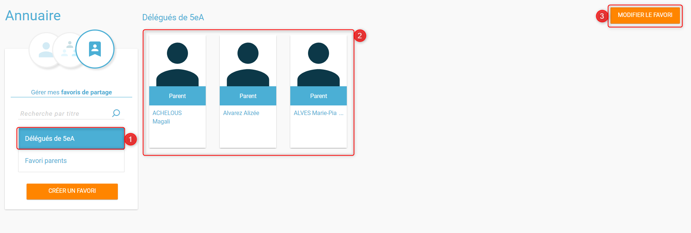
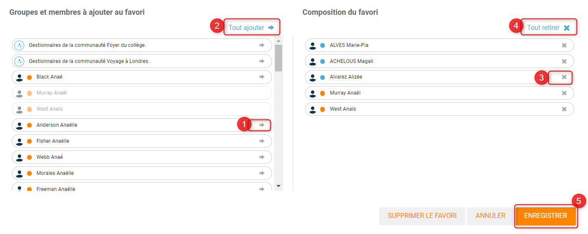
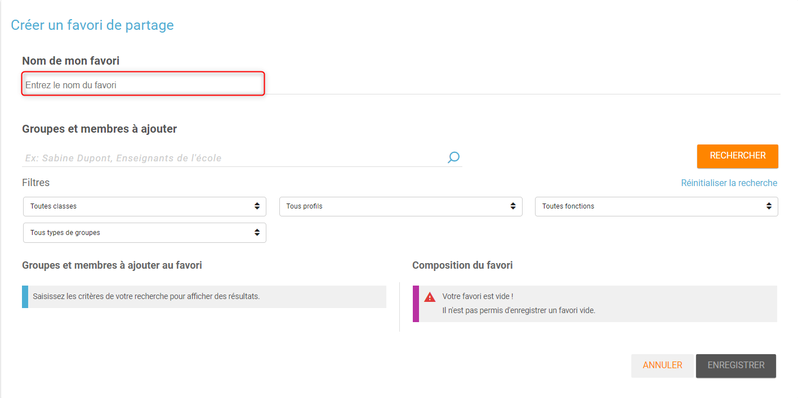
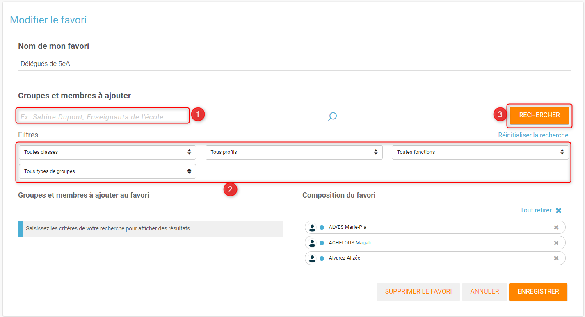

# Annuaire

Grâce à l’**Annuaire**, vous allez pouvoir rechercher les utilisateurs et les groupes avec lesquels vous pouvez communiquer. Vous pourrez également créer et gérer vos favoris de partage. Tout votre réseau accessible au même endroit !

## Présentation

Grâce au service "Annuaire", vous allez pouvoir :

* Rechercher un utilisateur
* Rechercher un groupe
* Créer et gérer des favoris de partage

## Rechercher un utilisateur

Vous pouvez rechercher facilement et rapidement un utilisateur. Pour effectuer votre recherche, vous disposez un onglet de recherche \(1\) et de filtres afin d’affiner les résultats. Vous pourrez filtrer par :

* Classe \(2\)
* Profil \(élève, enseignant, parent, personnel, invité\) \(3\)
* Fonction \(administrateur\) \(4\)

Une fois l’utilisateur trouvé, vous pouvez consulter sa fiche. Vous avez la possibilité de lui envoyer un message \(1\), l’ajouter dans vos favoris de partage \(2\), ou consulter tout simplement les informations disponibles sur sa fiche.

## Rechercher un groupe

Vous pouvez rechercher facilement et rapidement un groupe d’utilisateurs. Pour effectuer votre recherche, vous disposez un onglet de recherche \(1\) et de filtres afin d’affiner les résultats. Vous pourrez filtrer par :

* Classe \(2\)
* Profil \(élève, enseignant, parent, personnel, invité\) \(3\)
* Fonction \(administrateur\) \(4\)
* Type de groupe \(Groupe d’enseignement, groupe de communauté, groupe manuel\) \(5\)

Une fois le groupe trouvé, vous pouvez accéder à la liste des utilisateurs concernés. Vous avez la possibilité d’envoyer un message au groupe \(1\), d’ajouter le groupe à vos favoris de partage \(2\), ou consulter leurs fiches individuelles.

## Gérer vos favoris de partage

En cliquant sur la fenêtre des favoris, vous pourrez gérer des listes d’utilisateurs avec lesquels vous communiquez régulièrement. Vous retrouverez vos listes de favoris à chaque fois que vous aurez besoin de partager un contenu, à travers l’onglet de recherche d’utilisateurs dans la fenêtre de partage, ainsi que dans la messagerie. Dans cet espace, vous voyez apparaître vos favoris préalablement enregistrés \(1\). Vous avez la possibilité d’effectuer une recherche dans vos listes de favoris grâce à la barre de recherche \(2\), ou bien de créer directement une liste \(3\).

## Consulter et modifier un favori

Pour consulter une liste de favoris, cliquez sur son nom dans l’onglet de gauche \(1\). Vous voyez apparaître la liste des utilisateurs concernés \(2\). Si vous souhaitez supprimer ou ajouter des utilisateurs, ou des groupes d’utilisateurs à cette liste, cliquez sur "Modifier le favori" \(3\).

Pour ajouter un utilisateur ou un groupe à votre favori, vous pouvez utiliser la barre de recherche \(1\), et affiner votre recherche grâce au système de filtres \(2\). Cliquez ensuite sur "Rechercher" pour faire apparaître des propositions d’utilisateurs \(3\)

Les utilisateurs et les groupes suggérés apparaissent dans la liste "Groupes et membres à ajouter au favori". Vous pouvez ajouter individuellement des membres à votre favori en cliquant sur la flèche à droite de l’utilisateur \(1\), ou bien ajouter tous les utilisateurs en cliquant sur "Tout ajouter" \(2\).

Pour supprimer de votre liste des utilisateurs ou des groupes, vous pouvez cliquez individuellement sur la croix à droite de leur nom \(3\) ou retirer tous les utilisateurs en cliquant sur "Tout retirer" \(4\). Afin de valider vos modifications, cliquez sur le bouton "Enregistrer". Important : si vous supprimez un groupe ou un utilisateur d’un favori qui a déjà été utilisé, les partages déjà effectués ne seront pas supprimés.

## Créer un favori

Vous pouvez créer directement votre liste de favori depuis l’annuaire. Pour cela, il vous suffit de cliquer sur "Créer un favori".

Commencez par renseigner le nom de votre favori.

Ajoutez ensuite vos utilisateurs ou vos groupes à votre favori. Vous pouvez utiliser la barre de recherche \(1\), et affiner votre recherche grâce au système de filtres \(2\). Cliquez ensuite sur "Rechercher" pour faire apparaître des propositions d’utilisateurs \(3\)

Les utilisateurs et les groupes suggérés apparaissent dans la liste "Groupes et membres à ajouter au favori". Vous pouvez ajouter individuellement des membres à votre favori en cliquant sur la flèche à droite de l’utilisateur \(1\), ou bien ajouter tous les utilisateurs en cliquant sur "Tout ajouter" \(2\).

Pour supprimer de votre liste des utilisateurs ou des groupes, vous pouvez cliquez individuellement sur la croix à droite de leur nom \(3\) ou retirer tous les utilisateurs en cliquant sur "Tout retirer" \(4\). Afin de valider vos modifications, cliquez sur le bouton "Enregistrer". Important : si vous supprimez un groupe ou un utilisateur d’un favori qui a déjà été utilisé, les partages déjà effectués ne seront pas supprimés.

Vous avez également la possibilité de créer des listes de favoris directement depuis la fenêtre de partage. Une option "Enregistrer comme favori de partage" est disponible dans toutes les fenêtres de partage, pour enregistrer rapidement et sans effort vos listes favorites.

